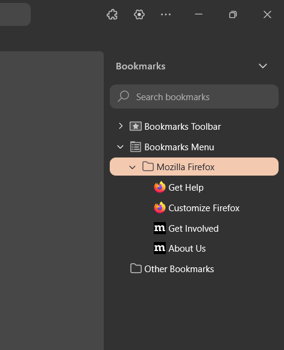

# Zen Better Sidebar



[](https://github.com/rasyidrafi/zen-better-sidebar)
[](LICENSE)
[](https://zen-browser.app/)

**Version 1.0.3**

A modern theme extension for Zen Browser that enhances the default Firefox sidebar with a sleek, modern look and feel that perfectly matches Zen's UI design language.

## Table of Contents

- [Features](#features)
- [Prerequisites](#prerequisites)
- [Installation](#installation)
- [What This Theme Does](#what-this-theme-does)
- [Compatibility](#compatibility)
- [Requirements](#requirements)
- [Contributing](#contributing)
- [Support](#support)
- [License](#license)
- [Changelog](#changelog)
- [Author](#author)

## Features

- 🎨 **Modern Design** - Transforms the sidebar with rounded corners and modern styling that matches Zen's aesthetic
- 🔍 **Enhanced Search** - Improved search box styling with better visual feedback and hover states
- 🎯 **Clean Navigation** - Streamlined sidebar header and navigation elements for better usability
- 📚 **Better Tree View** - Enhanced bookmark and history tree styling with smooth hover effects and proper selection states
- ⚡ **Lightweight** - Pure CSS implementation with minimal JavaScript enhancement for optimal performance
- 🎭 **Theme Integration** - Seamless integration with Zen's color scheme and theming system
- 🔧 **Easy Installation** - Simple installation through Sine theme manager

## Prerequisites

Before installing this theme, you need to have **Sine** installed, which is a theme manager for Zen Browser and Firefox. If you don't know how to install Sine, [please click here to view the Sine installation Guide.](https://github.com/CosmoCreeper/Sine#%EF%B8%8F-installation)

### Installing Sine

1. Download Sine from the official repository
2. Follow the installation instructions for your browser
3. Restart your browser after installation

## Installation

### Method 1: Through Sine Theme Store (Recommended)

1. Open Sine menu in your browser
2. Search for "Better Sidebar" in the theme store
3. Click "Install" on the theme
4. The theme will be automatically applied

### Method 2: Manual Installation

If the theme is not available in the Sine theme store:

1. Open Sine menu
2. Enter the following repository URL:
   ```
   rasyidrafi/zen-better-sidebar
   ```
3. Click "Install" to add the theme
4. The theme will be applied

## What This Theme Does

This theme enhances the Firefox sidebar with:

- **Rounded corners** and modern border radius matching Zen's design
- **Improved spacing** and padding for better visual hierarchy
- **Enhanced hover effects** for interactive elements
- **Cleaner search interface** with better styling
- **Modern tree view** for bookmarks and history with proper selection states
- **Seamless integration** with Zen's color scheme and theming

The theme includes both CSS styling and JavaScript enhancements to provide the best possible sidebar experience.

## Compatibility

- ✅ **Zen Browser** (Primary target)
- ✅ **Firefox** (Requires Sine theme manager)
- ⚠️ **Firefox ESR** (May have limited compatibility)

## Requirements

- **Sine Theme Manager** - Required for installation and management
- **Zen Browser** or **Firefox** (latest versions recommended)

## Contributing

Found a bug or want to suggest an improvement? Feel free to open an issue or submit a pull request on the [GitHub repository](https://github.com/rasyidrafi/zen-better-sidebar/).

### How to Contribute

1. Fork the repository
2. Create your feature branch (`git checkout -b feature/AmazingFeature`)
3. Commit your changes (`git commit -m 'Add some AmazingFeature'`)
4. Push to the branch (`git push origin feature/AmazingFeature`)
5. Open a Pull Request

## Support

If you encounter any issues or need help:

- Check the [Issues](https://github.com/rasyidrafi/zen-better-sidebar/issues) page for known problems
- Open a new issue if your problem isn't listed
- For Sine-related issues, visit the [Sine repository](https://github.com/CosmoCreeper/Sine)

## License

This project is licensed under the MIT License - see the [LICENSE](LICENSE) file for details.

## Changelog

### Version 1.0.3 (August 5, 2025)
- Enhanced sidebar styling and modern design improvements
- Improved compatibility with latest Zen Browser versions
- Better integration with Zen's color scheme and theming

## Author

Created by [Muhammad Rasyid Rafi'i](https://github.com/rasyidrafi)
